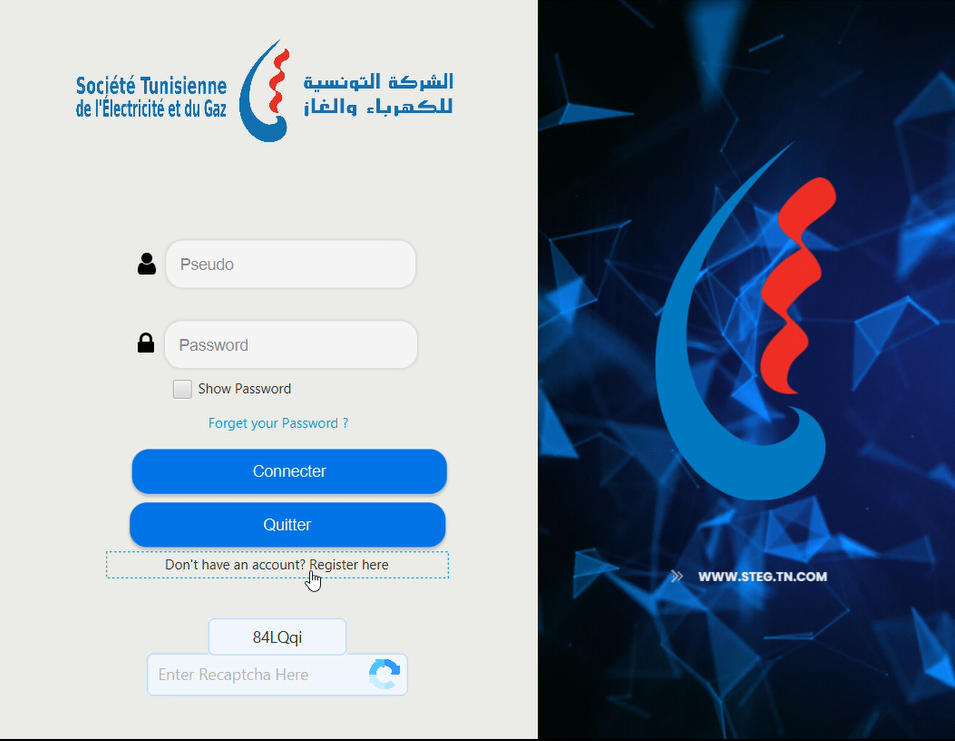
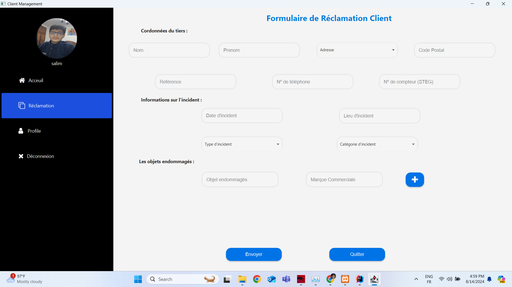
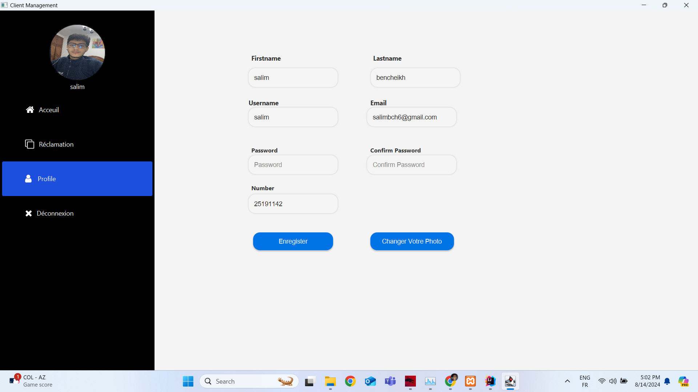
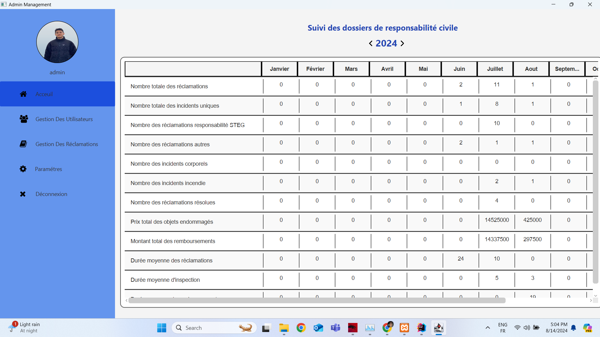
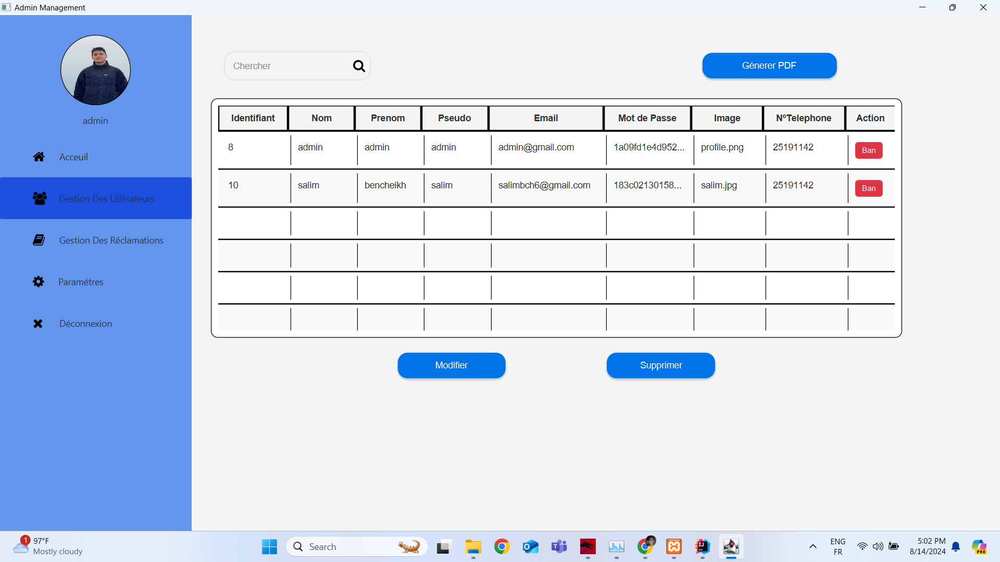
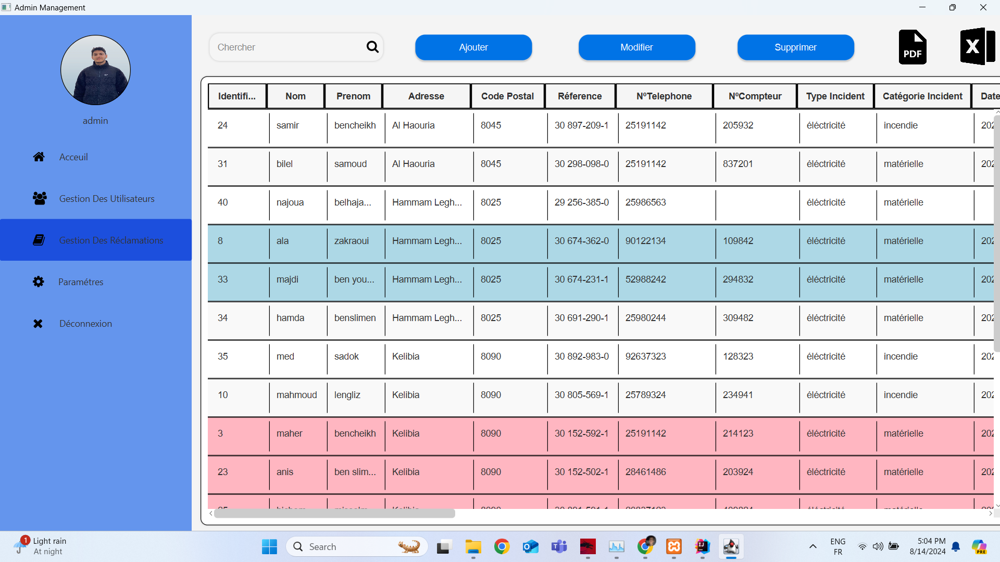
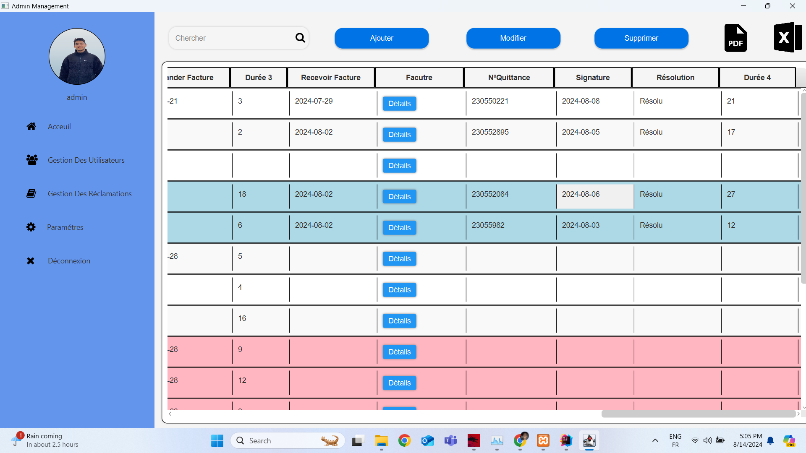
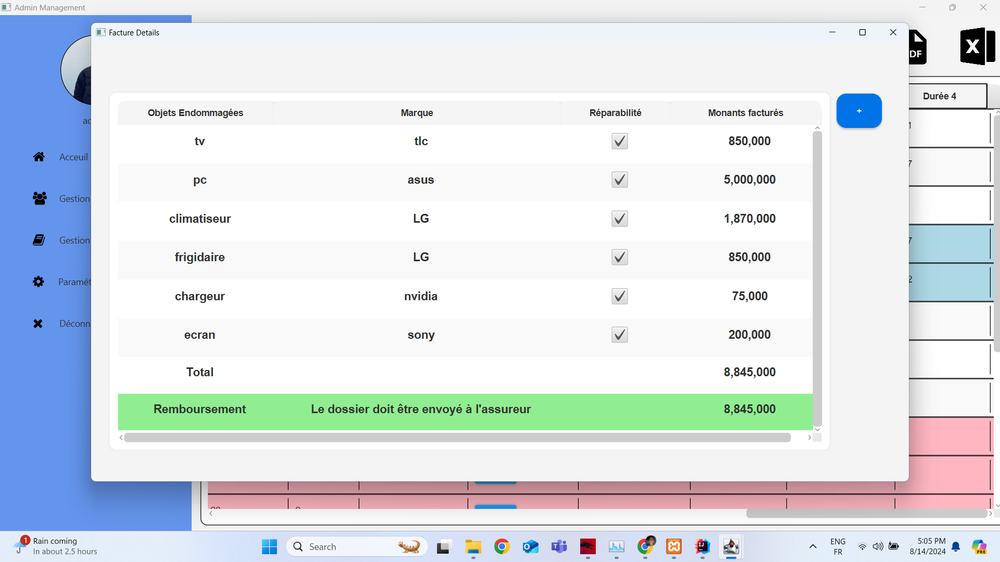
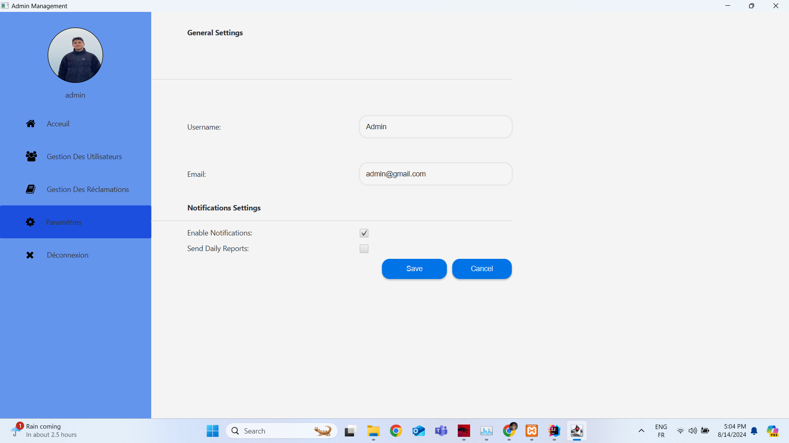

# ⚡️ STEG-Project – Customer Reclamation Management System

## 📜 Project Overview

During my internship at **STEG (Société Tunisienne de l'Électricité et du Gaz)**, I designed and developed a **full-stack Java application** aimed at improving the management of customer interactions and optimizing the handling of reclamations.  
The system provides features for efficient tracking and rapid resolution of customer complaints while also integrating **invoice management** for a complete and streamlined service experience.

---

## 🚀 Features

- 📩 **Complaint Submission:** Customers can easily submit reclamations with detailed information.
- 🔎 **Complaint Tracking:** Track the status and progress of each complaint in real time.
- 🧑‍💼 **User & Role Management:** Admin and user accounts with role-based access control.
- 📊 **Administrative Dashboard:** Centralized interface to view, filter, and manage all complaints.
- 🧾 **Invoice Management:** Integrated billing and invoice handling linked to customer profiles.
- 📈 **Reporting & Analytics:** Generate statistics and reports on complaint resolution and performance.

---

## 🧰 Tech Stack

- **Java** – Core backend development  
- **Maven** – Project build and dependency management  
- **Spring Boot** – Backend framework for REST APIs *(if used)*  
- **JDBC / JPA** – Database connectivity  
- **MySQL / PostgreSQL** – Data storage and retrieval  
- **HTML / CSS / JS** – (Optional) for front-end interfaces

---

## 📸 Application Preview

### 👤 Client Side

  

  

  

---

### 🛠️ Admin Side

  

  

  

  

  

  

